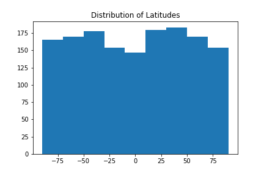

# Temperature vs Latitude


Deployed at: https://jackrapp.github.io/weather_visualization/

## Project Summary

To test the generally accepted fact that it is warmer nearer to the equator we gathered weather data from OpenWeatherMap API using a randomly generated set of cities. Scatter plots were generated using MatPlotLib to show relationships and explore any interesting patterns in the data.

### Data Collection

To gather weather data, pairs of coordinates were selected at random using a random number generator, latitude range from -90 to 90, longitude range -180 to 180. 1500 datapoints were input into the library citypy with the goal of ending up with 500 cities to compare.



Using the generated list of cities and OpenWeatherMap's API, weather data was uploaded into an empty data frame. Any cities with no weather stations are ignored and every 60 cities the API pauses to avoid the API request limit.

#### API code
```python
#loop through city list
for city in cities:
    #make url with city name
    query_url = f"{base_url}{city}&APPID={api_key}&units=imperial"
    #make api request
    res = requests.get(query_url)
    #convert to json
    res = res.json()
    try:
        #add info to dataframe
        #data to gather:city name, date, cloudiness, temp, humidity, wind speed, lat, lng
        cities_df.loc[city_num,"City"] = res["name"]
        cities_df.loc[city_num,"Date"] = res['dt']
        cities_df.loc[city_num,"Cloudiness"] = res['clouds']['all']
        cities_df.loc[city_num,"Temperature"] = res["main"]["temp"]
        cities_df.loc[city_num,"Humidity"] = res["main"]["humidity"]
        cities_df.loc[city_num,"Wind speed"] = res['wind']['speed']
        cities_df.loc[city_num,"Latitude"] = res['coord']['lat']
        cities_df.loc[city_num,"Longitude"] = res['coord']['lon']
        print(f"Processing request {city_num} {city}")
        
        #add to city count/index
        city_num = city_num +1
            
        #check for time delay using remainder, delay on 60 sec intervals
        if np.mod(city_num,60) == 0:
            print("-------------")
            print("Search Paused")
            print("-------------")
            time.sleep(60)
            
    #if city not found
    except KeyError:
        print(f"Error {city} not found")
        
print("--------------")
print("Done Searching")
print("--------------")
```

### Data Visulaization and Analysis

Using matplotlib and the library pyplot, temperature, humidity, cloudiness and windspeed are all graphed against latitude.

##### Temperature Comparison


```python
#data frame cities_df
cities_df = pd.read_csv(output_data_file)
plt.scatter(cities_df["Latitude"], cities_df["Temperature"], alpha=.6)
plt.title("Temperature vs. Latitude")
plt.xlabel("Latitude")
plt.ylabel("Temperature (Farenheit)")

#save figure
plt.savefig("Resources/Latitude_vs_Temp.png")
plt.show()
```

Visit https://jackrapp.github.io/weather_visualization/ to see more
